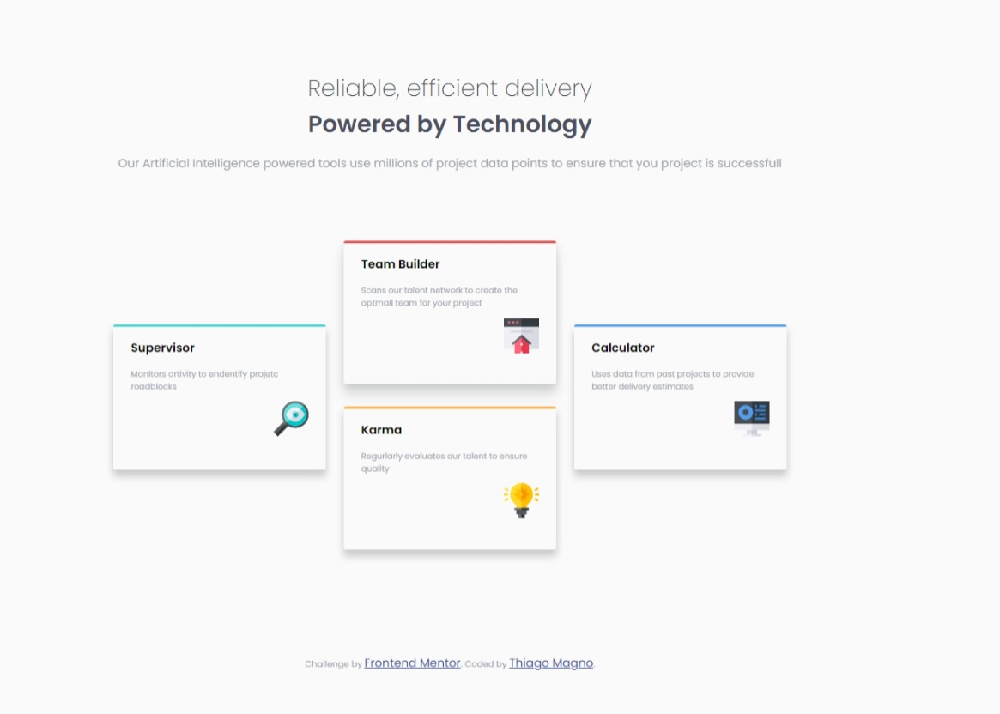
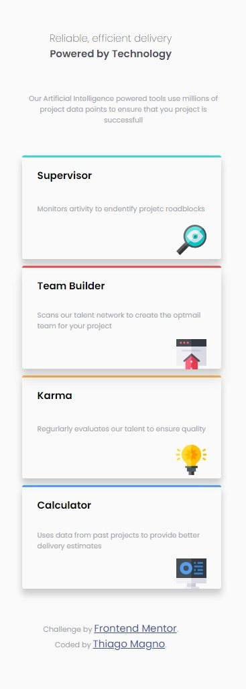

# Frontend Mentor - Four card feature section solution

This is a solution to the [Four card feature section challenge on Frontend Mentor](https://www.frontendmentor.io/challenges/four-card-feature-section-weK1eFYK). Frontend Mentor challenges help you improve your coding skills by building realistic projects. 

## Table of contents

  
# Frontend Mentor - Four card feature section solution

This is a solution to the [Four card feature section challenge on Frontend Mentor](https://www.frontendmentor.io/challenges/four-card-feature-section-weK1eFYK). Frontend Mentor challenges help you improve your coding skills by building realistic projects. 

  - [Table of contents](#table-of-contents)
  - [Overview](#overview)
    - [The challenge](#the-challenge)
    - [Screenshot](#screenshot)
  - [My process](#my-process)
    - [Built with](#built-with)
    - [What I learned](#what-i-learned)
    - [Useful resources](#useful-resources)
  - [Author](#author)

## Overview

### The challenge

Your users should:

- View the optimal layout for the site depending on their device's screen size

### Screenshot

## My process

### Built with

- Semantic HTML5 markup
- CSS custom properties
- Flexbox
- CSS Grid
- Mobile-first workflow
- For styles
  
### What I learned
- Over the curse of the challenge I revisited some important consepts of CSS, and learned some more Flexbox and Grid techiniqhes so I could finish it properly.
- Most of it was the manifulation with justify-contet and other properties  
  
### Useful resources

- [Example resource 1](https://www.youtube.com/watch?v=HN1UjzRSdBk) - This is an amazing video which helped me finally understand the CSS Grid . I'd recommend it to anyone still learning this concept. It's on portuguese that is my main language.
- 
- [Example resource 2](https://www.youtube.com/watch?v=HN1UjzRSdBk) - This is an amazing video which helped me finally understand the CSS Flexbox . I'd recommend it to anyone still learning this concept. This is also portuguese, but the video itself is really ilustrative and easy to understand.

## Author

- Twitter - [@ThiagoMagno23](https://www.twitter.com/)

